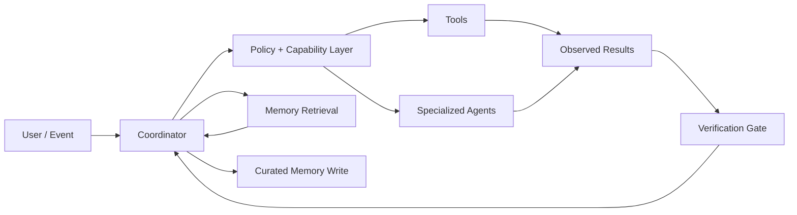

# Eclipse AI

[](https://github.com/emorban/eclipse-ai/actions/workflows/portfolio-ci.yml)

**Public engineering portfolio for Eclipse — a persistent agentic AI system exploring durable memory, tool use, multi-agent orchestration, verification, and safe local automation.**

Eclipse is an attempt to answer a harder question than “can a model respond intelligently?”: **how do you build an AI system that can remember useful context, use tools, delegate work, verify outcomes, and operate safely across real workflows?**

This repository is intentionally sanitized for public inspection. The private Eclipse runtime, personal memory, credentials, live configuration, operational runbooks, and provider-specific infrastructure are not published here.

## Start here

- **[Case study](./docs/CASE-STUDY.md)** — problem, design decisions, ownership, and lessons
- **[Architecture](./docs/ARCHITECTURE.md)** — public system map and boundaries
- **[Approval kernel](./approval_kernel)** — primary code: a stdlib-only reference implementation of the approval boundary (versioned candidates, owner challenges, tamper-evident ledger, scoped authority tokens)
- **[Engineering highlights](./docs/ENGINEERING-HIGHLIGHTS.md)** — memory, tools, delegation, verification, and safety
- **[Representative code](./samples)** — small sanitized implementation examples
- **[Executable tests](./tests)** — adversarial tests for the approval kernel plus the public samples

## What Eclipse explores

- **Persistent memory** — separate transient conversation context from durable, curated memory
- **Tool execution** — turn model intent into explicit, inspectable actions
- **Multi-agent orchestration** — divide work across specialized agents without confusing delegation with completion
- **Capability boundaries** — distinguish read-only actions from state-changing operations
- **Verification gates** — require evidence that an artifact or state actually exists before marking work complete
- **Runtime truth** — prefer live system state over stale remembered assumptions
- **Safe automation** — keep approvals and write permissions explicit around consequential actions

## System at a glance



The public architecture focuses on the surrounding agent system rather than any specific model provider. The design goal is to keep reasoning, execution, memory, and verification as distinct responsibilities.

## Engineering principles

### 1. Memory is curated, not accumulated
Long-term memory should not be a transcript dump. Durable context needs an explicit write boundary, retrieval behavior, retention rules, and a way to distinguish remembered context from current operational truth.

### 2. Tools have capabilities
A lookup and a state-changing action should not share the same execution posture. Write-capable tools require an explicit permit in the public router example.

### 3. Delegation is not completion
A worker or sub-agent returning “done” is not enough. The parent system should verify the requested artifact, state change, or acceptance condition independently.

### 4. Verify live state before trusting memory
Persistent systems inevitably accumulate stale assumptions. Current configuration, health, files, and service state should override remembered descriptions when they disagree.

### 5. Automation needs clear authority boundaries
The system can prepare, analyze, and execute within defined scopes, but consequential writes should remain explicit, reviewable, and attributable.

## Run the public verification suite

No third-party dependency is required. Python 3.11+ is enough for everything here.

```bash
python -m unittest discover -s tests -v
```

Most of the suite covers [`approval_kernel`](./approval_kernel), and most of those tests are adversarial: tampered payloads, replayed nonces, expired sessions and authorities, stale versions, scope escalation, exhausted limits, direct SQLite tampering caught by the hash-chain verifier, and concurrent threads racing for one limited authority.

## What I owned

I designed the operating model and system boundaries behind Eclipse: agent roles, memory discipline, tool capabilities, delegation rules, approval boundaries, verification requirements, and reliability checks. I directed implementation, reviewed agent and code output, tested failure cases, and iterated the system toward a more reliable local AI operating environment.

The public repository is meant to demonstrate that systems thinking without publishing the private operator environment itself.

## Repository guide

```text
approval_kernel/
  README.md          invariants, threat model, usage
  canonical.py       canonical JSON + content hashing
  candidates.py      immutable, versioned action candidates + risk registry
  sessions.py        owner sessions, challenges, single-use nonces
  ledger.py          append-only, HMAC hash-chained decision ledger
  authority.py       scoped, signed, expiring authority tokens
  kernel.py          the approval boundary that wires the pieces together
  storage.py         SQLite schema, triggers, transactions
  clock.py, errors.py
docs/
  CASE-STUDY.md
  ARCHITECTURE.md
  ENGINEERING-HIGHLIGHTS.md
samples/
  memory_store.py
  tool_router.py
  verification_gate.py
tests/
  approval_support.py
  test_approval_authority.py
  test_approval_candidates.py
  test_approval_ledger.py
  test_approval_sessions.py
  test_memory_store.py
  test_tool_router.py
  test_verification_gate.py
.github/workflows/
  portfolio-ci.yml
SECURITY.md
NOTICE.md
```

## Public / private boundary

This public repository must not contain:

- personal or long-term operator memory
- live runtime configuration
- API keys, credentials, tokens, or secret locations
- private filesystem paths or host identifiers
- messaging/channel credentials
- operational recovery procedures
- current task queues or private project state
- provider account identifiers
- private logs, reports, or backups

If you discover something that appears sensitive, please use the reporting guidance in [`SECURITY.md`](./SECURITY.md).

## Related work

- **[DevHouse AI](https://github.com/emorban/devhouse-ai)** — production-oriented AI workflow, CRM, voice, consent, and reliability systems

## Portfolio use

Source in this repository is published for inspection and evaluation. No open-source license is granted. See [`NOTICE.md`](./NOTICE.md).

---

**Eclipse AI · ELISON INC**