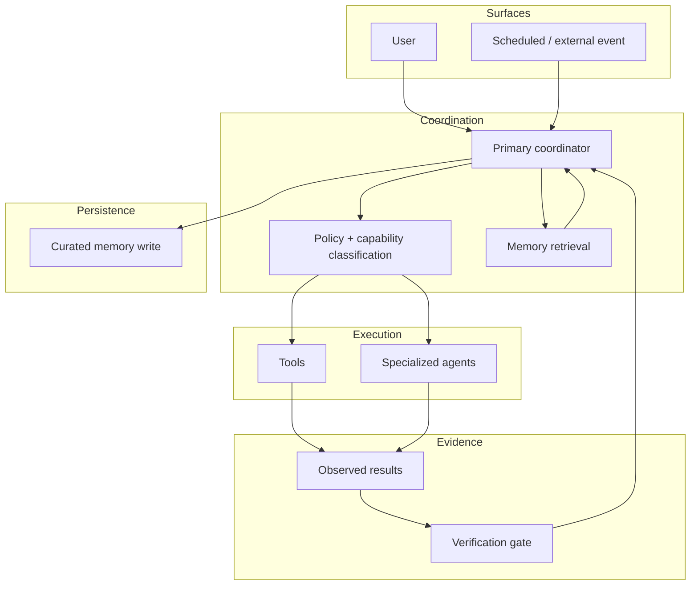

# Eclipse AI — Architecture

This document describes the public architecture of Eclipse AI. It intentionally omits personal memory, provider credentials, live runtime configuration, recovery procedures, machine-specific paths, and private operational details.

## Core loop

## Layer responsibilities

### Command surfaces
A request may originate from a direct user interaction or a scheduled/system event. The surface should not own business logic; it forwards intent into the coordinator.

### Coordinator
The coordinator decomposes work, chooses whether to act directly or delegate, decides what context is needed, and remains responsible for the final result.

### Policy and capability layer
Before execution, the system classifies what a tool or task can do. A read-only operation has a different risk profile from an action that changes files, sends messages, moves money, modifies infrastructure, or affects production state.

The public sample keeps this simple: tools declare whether they write state, and callers must explicitly permit writes.

### Memory retrieval
Persistent memory is treated as supporting context, not unquestionable truth. Retrieval should be scoped to the current task and current runtime state should override stale remembered information.

### Specialized agents
Sub-agents can divide work by capability or domain. Delegation is useful for parallelism and separation of concerns, but the coordinator remains responsible for checking the result.

### Tools
Tools translate intent into explicit execution. They are easier to audit, constrain, and verify than unconstrained free-form action.

### Observed result
Execution returns evidence: a value, file, state transition, test result, or provider response. This evidence is distinct from an agent merely saying that work succeeded.

### Verification gate
The verification layer checks whether the acceptance condition is actually true. A claimed artifact should exist; a required output should be present; a failed check should prevent a false “done” state.

### Curated memory write
Only durable information should be promoted into long-term memory. The write boundary should remain deliberate so the system does not turn every transient conversation or failed assumption into permanent context.

## Key architectural decisions

### Separate reasoning from authority
A model may recommend an action without automatically possessing permission to execute it. Authority belongs in explicit system policy, not in the model’s confidence.

### Separate read paths from write paths
Read-only discovery and verification are safer to run broadly. State-changing operations need tighter scope, stronger validation, and clearer auditability.

### Prefer evidence over status messages
A worker response is useful context, but a completion claim should be grounded in observable state wherever possible.

### Treat degraded operation as normal
Tools, agents, providers, and memory can fail or return incomplete information. The parent workflow should preserve errors, choose safe fallback behavior when available, and avoid fabricating success.

## Public boundary

The portfolio includes concepts, sanitized samples, and tests. The following remain private:

- live runtime topology
- agent/provider credentials
- personal memory and private project context
- operational recovery/failover procedures
- current host, network, or messaging configuration
- production task history and logs

The goal is to make the system design inspectable without turning a public portfolio into an operational blueprint.